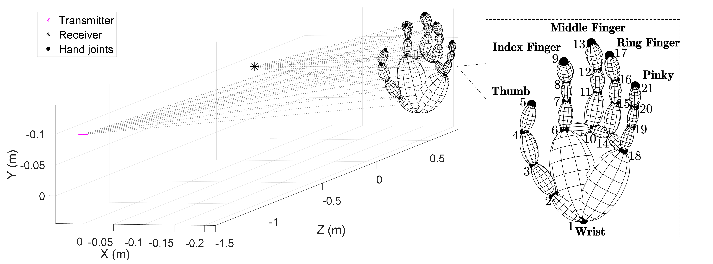

<big>**"Simulation Meets Reality" in Wireless Channel**</big>&nbsp;(April. 2023 - Now)

- **CASTER:** Design a computer-vision-assisted simulation **software pipeline** to address the issue of **"labor-intensive" training radar dataset acquisition for mmWave-based wireless hand gesture recognition**. That is, in the proposed CASTER simulator, the training radar dataset can be simulated **via existing videos by ray-tracing based channel modeling**. Particularly, in the channel simulation, a gesture is represented by a sequence of snapshots, and the channel impulse response of each snapshot is calculated via tracing the rays scattered off a primitive-based hand model. Moreover, CASTER simulator relies on the existing video clips to extract the motion data of gestures. Thus, the massive measurements of wireless channel can be eliminated. The experiments first demonstrate an 83.0% average recognition accuracy of simulation-to-reality inference in recognizing 5 categories of gestures. Moreover, this accuracy can be boosted to 96.5% via the method of transfer learning. **[OJ-COMS'24]**

  

  Zhenyu Ren, Guoliang Li, <strong>Chenqing Ji</strong>, Chao Yu, Shuai Wang, and Rui Wang. “CASTER: A Computer-Vision-Assisted Wireless Channel Simulator for Gesture Recognition,” in <i>IEEE Open Journal of the Communications Society</i>, vol. 5, pp. 3185-3195, 2024 (Current impact factor: 7.9, JCR Q1). [[Paper]](../files/Ji-CASTER.pdf) | [[GitHub]](https://github.com/rzy0901/testSpectrogram) | [[Project Page]](https://lasso-sustech.github.io/CASTER/) (with three video demos).

